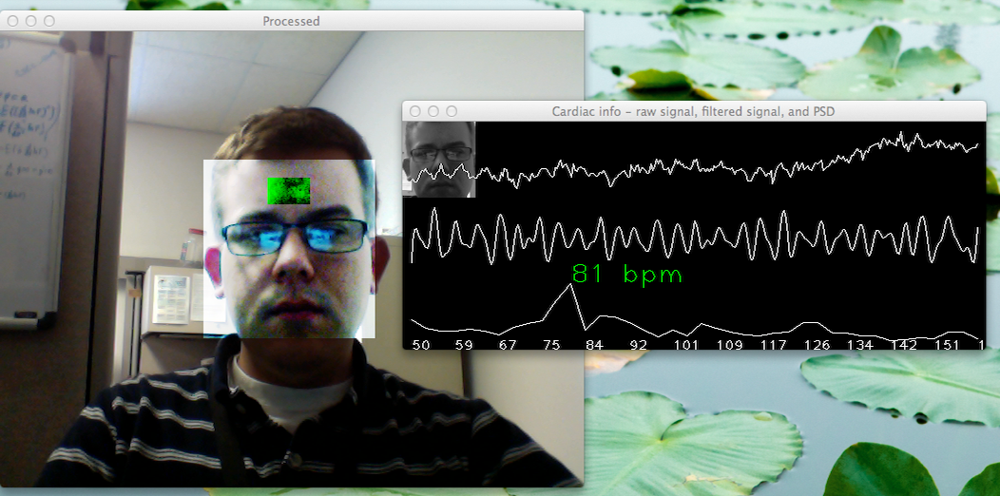
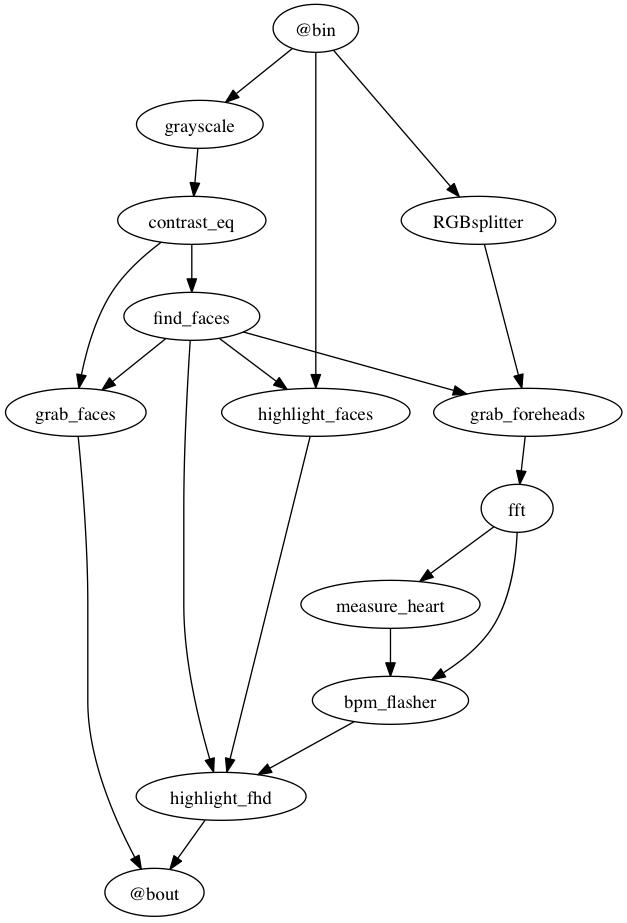

webcam-pulse-detector
=====================

A python application that detects the heart-rate of an individual using their 
computer's webcam. Tested on OSX 10.7 (Lion), Ubuntu 13.04 (Ringtail), and Windows 7.

Inspired by reviewing recent work on Eulerian Video Magnification (http://people.csail.mit.edu/mrub/vidmag/), 
with motivation to implement something comparable to their pulse detection examples in python-opencv, based on a few previous efforts (such as 
https://github.com/mossblaser/HeartMonitor).

Data processing is implemented within an openMDAO (http://openmdao.org/) assembly object to facilitate rapid 
prototyping/redesign of the real-time analysis, and for simple embedding into a python application.

How it works:
-----------------
This application uses openCV (http://opencv.org/) to find the location of the user's face, then isolate the forehead region. Data is collected
from this location over time to estimate the user's heartbeat frequency. This is done by measuring average optical
intensity in the forehead location, in the subimage's green channel alone. Physiological data can be estimated
this way thanks to the optical absorbtion characteristics of oxygenated hemoglobin. 

With good lighting and minimal noise due to motion, a stable heartbeat should be 
isolated in about 15 seconds. Other physiological waveforms, such as Mayer waves 
(http://en.wikipedia.org/wiki/Mayer_waves), should also be visible in the raw data stream.

Once the user's pulse signal has been isolated, temporal phase variation associated with the 
detected hearbeat frequency is also computed. This allows for the heartbeat 
frequency to be exaggerated in the post-process frame rendering; causing the 
highlighted forhead location to pulse in sync with the user's own heartbeat (in real time).

Support for pulse-detection on multiple simultaneous people in an camera's 
image stream is definitely possible, but at the moment only the information from one face 
is extracted for cardiac analysis

The overall dataflow/execution order for the real-time signal processing looks like:



This process design is implemented in the openMDAO assembly object defined in [lib/processors.py](lib/processors.py).
Essentially, the portion of the analysis that tries to emulate the look of the Eulerian Video Magnification video 
feedback is shown in the lower-right corner of this graph, from the `fft` component to `highlight_fhd`. The other 
components handle color pre-processing, head detection/tracking, annotation and highlighting, etc.

The definition of each component block used can be found in the source 
files [lib/imageProcess.py](lib/imageProcess.py), [lib/signalProcess.py](lib/signalProcess.py), and 
[lib/sliceops.py](lib/sliceops.py). The `@bin` and `@bout` blocks in the above graph denote assembly-level input and output.


Requirements:
---------------

- Python v2.7+ (http://python.org/)
- OpenCV v2.4+, with the cv2 python bindings (http://opencv.org/)
 
OpenCV is a powerful open-source computer vision library, with a convenient 
numpy-compatible interface in the cv2 bindings.

- OpenMDAO v0.5.5+ (http://openmdao.org/)

OpenMDAO is an open-source engineering framework that serves as a convenient 
enviroment to containerize the required real-time analyses, and 
allow for it to be easily tweaked to specification.
It requires python 2.6+, numpy, scipy, and matplotlib 
(see http://openmdao.org/docs/getting-started/requirements.html)

Quickstart:
------------
- Activate the openMDAO virtual python environment in a command or terminal window

```
. OpenMDAO/bin/activate
```
- In the activated environment, navigate to the downloaded source directory, and run get_pulse.py to start the application

```
python get_pulse.py
```
- If there is an error, try running `test_webcam.py` in the same directory to check if your openCV installation and webcam can be made to work
with this application.

Usage notes:
----------
- When run, a window will open showing a stream from your computer's webcam
- When a forehead location has been isolated, the user should press "S" on their 
keyboard to lock this location, and remain as still as possible (the camera 
stream window must have focus for the click to register). This freezes the aquisition location in place. This lock can
be released by pressing "S" again.
- To view a stream of the measured data as it is gathered, press "D". To hide this display, press "D" again.
- The data display shows three data traces, from top to bottom: 
   1. raw optical intensity
   2. extracted heartbeat signal
   3. Power spectral density, with local maxima indicating the heartrate (in beats per minute). 
- With consistent lighting and minimal head motion, a stable heartbeat should be 
isolated in about 15 seconds.
- If a large spike in optical intensity is measured in the data (due to motion 
noise, sudden change in lighting, etc) the data collection process is reset and 
started over. The sensitivity of this feature can be tweaked by changing `data_spike_limit` on line 31 of [get_pulse.py](get_pulse.py).
Other mutable parameters of the analysis can be changed here as well.

TODO:
------
- Show the detected bpm somewhere in the camera stream
- Support for multiple individuals
- Smoother tracking of data from foreheads, perhaps by buffering and registering/inverse-transforming image subframes

